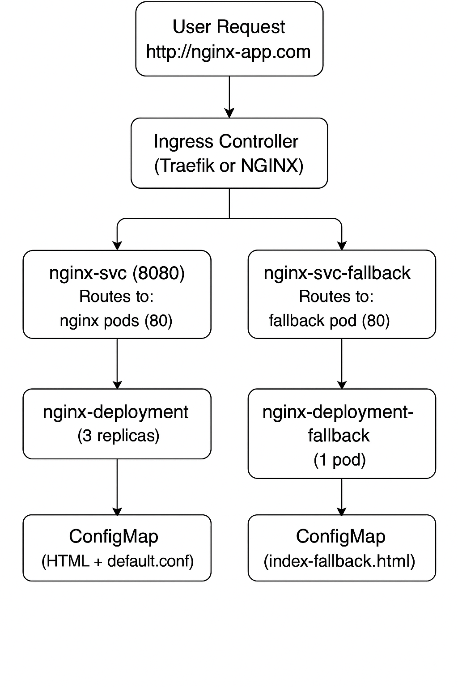

# kubernetes-projects
## nginx
**This project demonstrates how to deploy a customized NGINX application on Kubernetes, complete with custom error pages, ingress routing via both Traefik and NGINX controllers, and a fallback mechanism for handling failures or direct IP access. It also includes a test pod for validating service connectivity.**

### configmap/nginx-configmap.yaml
> Creates a ConfigMap containing custom Nginx configuration and static HTML pages.
- index.html: Serves as the default page (*http://nginx-app.com*)
- 404.html: Provides custom content for 404 errors (*http://nginx-app.com/some_non_existent_page*)
- index-fallback.html: Used as a fallback page for special error handling scenarios, such as when accessing the service via the node’s IP instead of its hostname (*http://<IP_address_of_node>*)
- default.comf: Custom nginx config that:
    - Serves files from /usr/share/nginx/html.
    - Routes unmatched paths to the 404.html page.

### deployment/nginx-deployment.yaml
> Deploys a replicated nginx application with 3 pods. It mounts custom HTML pages and an nginx configuration file from the *nginx-configmap.yaml* ConfigMap to serve personalized content and handle errors.

### service/nginx-svc.yaml
> Defines a Kubernetes ClusterIP service that routes traffic on port 8080 to nginx pods on port 80. Can be switched to LoadBalancer type to expose the service externally.

### pod/busybox.yaml
> Runs a BusyBox pod that fetches a page from the nginx service using a URL from the *nginx-configmap.yaml* ConfigMap (*nginx_url*) and then sleeps. Useful for testing service connectivity and environment variable injection.

### ingress/nginx-ingress-traefik.yaml
> Defines an Ingress rule for routing HTTP traffic from nginx-app.com to the nginx-svc service on port 8080, using Traefik as the ingress controller. For the hostname nginx-app.com add entry for this against the node IP exposed by the load balancer in */etc/hosts* file.

### ingress/nginx-ingress-nginx.yaml
>Routes HTTP traffic from nginx-app.com (port 80) to the internal nginx service on port 8080 using the NGINX Ingress controller.

### deployment/nginx-deployment-fallback.yaml
> Deploys a single NGINX pod using the nginx:alpine image. Serves a fallback HTML page from the *nginx-configmap* ConfigMap by mounting *index-fallback.html* to the default web path.

### service/nginx-svc-fallback.yaml
> Defines a Kubernetes ClusterIP service that routes traffic on port 8080 to nginx fallback pod on port 80.

### ingress/nginx-ingress-traefik-fallback.yaml
> Creates an Ingress rule for Traefik that routes all HTTP traffic on / to the fallback NGINX service on port 8080.

### ingress/nginx-ingress-nginx-fallback.yaml
> Configures the NGINX Ingress controller to route all HTTP traffic on / to the fallback NGINX service (nginx-svc-fallback) on port 8080.
